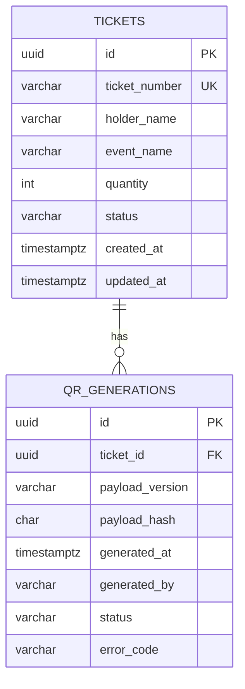

# Entity Relationship Diagram

The initial domain has two core entities.

## Relationship

One ticket can have zero or many QR generation records.

This keeps the current ticket state separate from the history of generation attempts and avoids overwriting operational history.
